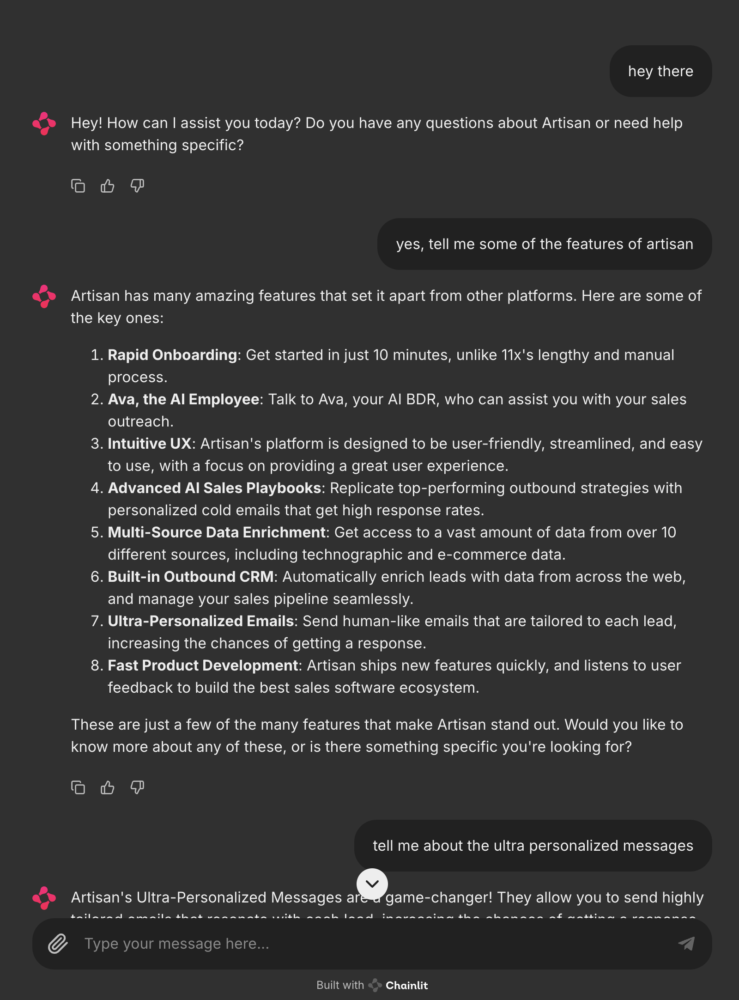

# Artisan Chatbot
This repository contains code for a simple chatbot that answers questions about [artisan.co](https://www.artisan.co).



## Design notes:
- The chatbot looks at the last 10 messages to generate a response. The whole message thread must be sent to the api because it's stateless.
- The backend is built on fastapi and llama-index.
- `Groq llama 3 70B` was chosen to minimize latency while preserving reasoning skills
- Website data was scraped with firecrawl and broken down with hierarchical chunking
- Text chunks are embedded with OpenAI's `text-embedding-3-large` model and stored in the default llama-index `VectorStoreIndex`
- Frontend is built on chainlit
- Both backend and frontend are deployed on azure containerapps

[Click here to try the app](http://frontend.whitedune-3fe30ea7.eastus.azurecontainerapps.io)


Send a post request to this URL to try the API: `https://chat.whitedune-3fe30ea7.eastus.azurecontainerapps.io/chat`

## API usage:
```python
import requests

message_thread = [
    {"role": "user", "content": "Hello World from user"},
    {"role": "assistant", "content": "Hello World from assistant"}
]

url = "https://chat.whitedune-3fe30ea7.eastus.azurecontainerapps.io/chat"
response = requests.post(url, json=message_thread)
print(response.json())
```

# Testing and Deployment
## Build and run locally
```bash
docker build -t chat chat/ 
docker run -p 8000:8000 -e GROQ_API_KEY=$GROQ_API_KEY -e OPENAI_API_KEY=$OPENAI_API_KEY chat 
python chat/test.py

docker build -t frontend frontend/
docker run -p 8000:8000 frontend
open http://localhost:8000
```


## Deploy on azure containerapp
After building and testing the images locally, push to the Azure Container Registry.
```bash
az acr login --name artisan
docker tag chat:latest artisan.azurecr.io/chat:latest
docker tag frontend:latest artisan.azurecr.io/frontend:latest
docker push artisan.azurecr.io/chat:latest
docker push artisan.azurecr.io/frontend:latest
```

Deploy the chat and frontend container apps.
```bash
az containerapp up \
    --name chat \
    --resource-group artisan \
    --image artisan.azurecr.io/chat:latest \
    --target-port 8000 \
    --ingress external \
    --query properties.configuration.ingress.fqdn\
    --location eastus \
    --registry-server artisan.azurecr.io \
    --registry-username artisan \
    --registry-password $(az acr credential show -n artisan --query "passwords[0].value" -o tsv)\
    --env-vars "GROQ_API_KEY=$GROQ_API_KEY" "OPENAI_API_KEY=$OPENAI_API_KEY"


az containerapp up \
    --name frontend \
    --resource-group artisan \
    --image artisan.azurecr.io/frontend:latest \
    --target-port 8000 \
    --ingress external \
    --query properties.configuration.ingress.fqdn\
    --location eastus \
    --registry-server artisan.azurecr.io \
    --registry-username artisan \
    --registry-password $(az acr credential show -n artisan --query "passwords[0].value" -o tsv)
```

To update the environment variables for the chat and frontend container apps:
```bash
az containerapp update \
    --name chat \
    --resource-group artisan \
    --set-env-vars "GROQ_API_KEY=$GROQ_API_KEY" "OPENAI_API_KEY=$OPENAI_API_KEY"
```